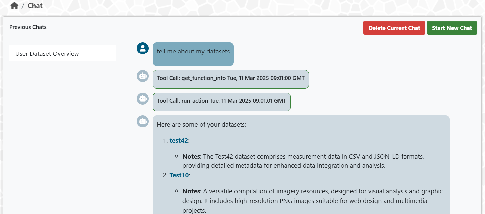

[](https://github.com/Mat-O-Lab/ckanext-chat/actions/workflows/test.yml)

# ckanext-chat

A plugin integrating a chat interface in ckan with a [pydanticai](https://ai.pydantic.dev/) agent that can use all available ckan actions and url_patterns. All actions are done with user aware context. The chat interface uses marked and highightjs to display responses. Chat histories are saved in the local storage of the user. The agent is chat history aware. 



## Requirements

A completion endpoint of the LLM model to use with the agent is needed. Currently uses Azure Cognitive Service Integration.
can be changed by replacing the client in /bot/agent.py

Compatibility with core CKAN versions:

| CKAN version    | Compatible?   |
| --------------- | ------------- |
| 2.9 and earlier | not tested    |
| 2.10             | yes    |
| 2.11             | yes    |

Suggested values:

* "yes"
* "not tested" - I can't think of a reason why it wouldn't work
* "not yet" - there is an intention to get it working
* "no"


## Installation

To install ckanext-chat:

1. Activate your CKAN virtual environment, for example:

     . /usr/lib/ckan/default/bin/activate

2. Clone the source and install it on the virtualenv

    git clone https://github.com/Mat-O-Lab/ckanext-chat.git
    cd ckanext-chat
    pip install -e .
	pip install -r requirements.txt

3. Add `chat` to the `ckan.plugins` setting in your CKAN
   config file (by default the config file is located at
   `/etc/ckan/default/ckan.ini`).

4. Restart CKAN. For example if you've deployed CKAN with Apache on Ubuntu:

     sudo service apache2 reload


## Config settings

In your env variables set:
```bash
CKANINI__CKANEXT__CHAT__COMPLETION_URL="https://your-subscription.openai.azure.com/"
CKANINI__CKANEXT__CHAT__DEPLOYMENT="gpt-4o"
CKANINI__CKANEXT__CHAT__API_TOKEN="your-api-token"
```
or ckan.ini parameters.

```ini
ckanext.chat.completion_url="https://your-subscription.openai.azure.com/"
ckanext.chat.deployment="gpt-4o"
ckanext.chat.api_token="your-api-token"
```

## Tests

To run the tests, do:

    pytest --ckan-ini=test.ini


## Releasing a new version of ckanext-chat

If ckanext-chat should be available on PyPI you can follow these steps to publish a new version:

1. Update the version number in the `pyproject.toml` file. See [PEP 440](http://legacy.python.org/dev/peps/pep-0440/#public-version-identifiers) for how to choose version numbers.

2. Make sure you have the latest version of necessary packages:

    pip install --upgrade setuptools wheel twine

3. Create a source and binary distributions of the new version:

       python -m build && twine check dist/*

   Fix any errors you get.

4. Upload the source distribution to PyPI:

       twine upload dist/*

5. Commit any outstanding changes:

       git commit -a
       git push

6. Tag the new release of the project on GitHub with the version number from
   the `setup.py` file. For example if the version number in `setup.py` is
   0.0.1 then do:

       git tag 0.0.1
       git push --tags

## License

[AGPL](https://www.gnu.org/licenses/agpl-3.0.en.html)
